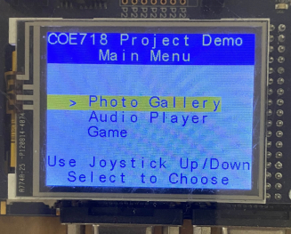
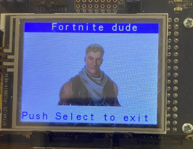
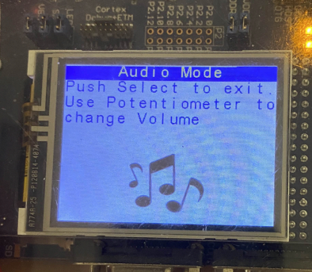
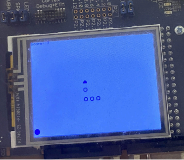
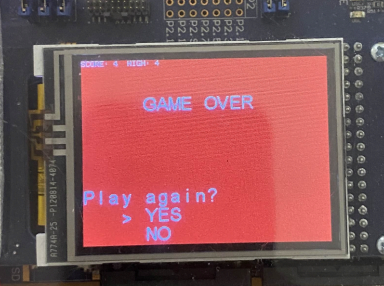
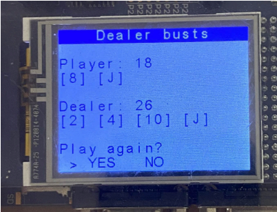
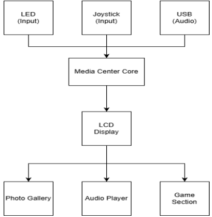
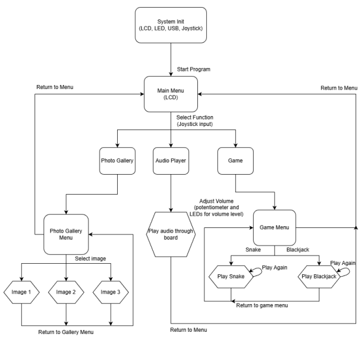

# MCB1700 Embedded Media Center

## Project Title

MCB1700 Embedded Media Center

## Motivation

This project was created for a course involving Embedded Systems Design to demonstrate an interactive embedded application using the MCB1700 development board and Keil µVision. The goal was to combine several course concepts into one working media center. The system includes a photo gallery, a USB audio player, and a game section with Snake and Blackjack. It uses the GLCD, joystick, LEDs, potentiometer, USB audio, ADC, DAC, and board support drivers.

## Features

- Joystick-controlled main menu
- Photo gallery with bitmap images converted into C arrays
- USB audio player that streams sound from a PC
- Potentiometer-based volume control with LED level display
- Snake game with border modes, scoring, collision detection, and LED feedback
- Blackjack game with hit/stand controls, dealer logic, Ace handling, and LED feedback
- Modular C source files for each feature

## Installation

To install and run the project:

1. Clone the repository to your computer.
2. Open the project in **Keil µVision**.
3. Select the **LPC1768 Flash** target.
4. Build the project.
5. Connect the **MCB1700** board to the PC.
6. Flash the compiled program to the board.
7. Use the onboard joystick to navigate the Media Center.

## Usage

### Main Menu

When the program starts, the GLCD displays the main menu with three options:

- Photo Gallery
- Audio Player
- Game

Use the joystick **Up** and **Down** directions to move through the menu. Press **SELECT** to open the highlighted option.



### Photo Gallery

The Photo Gallery displays three stored bitmap images. Each image was converted into a C array and displayed using `GLCD_Bitmap()`. When an image is shown, a matching LED turns on to indicate which image is active. Press **SELECT** to exit the image viewer and return to the gallery menu.



### Audio Player

The Audio Player is based on the LPC1768 USB Audio Demo. When selected, the board acts as a USB audio speaker for the PC. Audio is streamed from the PC to the board and played through the onboard speaker. The potentiometer controls volume, and the LEDs act as a volume level indicator. Press **SELECT** to exit audio mode.



### Game Section

The Game Menu provides three options:

- Snake
- Blackjack
- Return to Home

Use the joystick to choose a game and press **SELECT** to start it.

## Snake Game

Snake is played on a 10-by-20 GLCD text grid. The player controls the snake with the joystick. Food appears at random free positions, and the score increases when the snake eats food. The snake grows after each food item, and the movement delay decreases to make the game faster.

Snake includes two border modes:

- **Border ON:** hitting a wall ends the game.
- **Border OFF:** the snake wraps around the screen.

The game also detects self-collision. When the round ends, the score and high score are shown, and an LED blink effect runs using bit-band aliasing.

<p align="left">
  
  
</p>

## Blackjack Game

Blackjack is a simple text-based card game between the player and dealer. The player starts with two cards, and the dealer shows one visible card. Press **Up** to hit and **Down** to stand. The dealer then draws until reaching at least 17.

The game handles Aces as either 11 or 1, depending on the total. At the end of the round, the GLCD shows whether the player wins, the dealer wins, the player busts, the dealer busts, or the round is a tie. The result also triggers an LED blink pattern using bit-band aliasing.



## Controls

| Input | Action |
|---|---|
| Joystick Up | Move selection up / Hit in Blackjack / Move Snake up |
| Joystick Down | Move selection down / Stand in Blackjack / Move Snake down |
| Joystick Left / Right | Move Snake left or right / choose YES or NO in Blackjack result screen |
| SELECT | Confirm selection or exit selected screens |
| Potentiometer | Adjust audio volume |

## Functions

### Main Menu

The main menu is handled in `Blinky.c`. A `selector` variable tracks the highlighted menu item. The joystick is polled using `get_button()`, and pressing SELECT calls the selected module: `photo()`, `audio_main()`, or `start_game()`.

### Photo Gallery

The photo gallery is handled through `photo_gallery.c` and `photos.c`. The gallery menu lists three images, and `images(x)` displays the selected bitmap using `GLCD_Bitmap()`. The image data is stored as unsigned character arrays in separate source files.

### Audio Player

The audio player is based on the USB Audio Demo source files. The board receives audio from the PC through USB, stores incoming samples in a buffer, and sends the output to the DAC through Timer0 interrupt handling. The potentiometer is read through the ADC to adjust the volume, and LEDs display the volume level.

### Game Menu

The game menu is handled in `game.c`. It allows the user to choose Snake, Blackjack, or return to the main menu.

### Snake

The Snake game is implemented in `snake.c`. The snake body is stored in a two-dimensional array, where index 0 represents the head. The game handles movement, food spawning, collision detection, scoring, border mode, game-over logic, and LED effects.

### Blackjack

The Blackjack game is implemented in `blackjack.c`. It stores cards as integer values from 1 to 13, converts them into card symbols, calculates hand totals, handles Aces, and manages the player and dealer phases.

## System Diagrams

### Top-Level Block Diagram



### System Flowchart



## Hardware Components

- MCB1700 development board
- LPC1768 microcontroller
- GLCD screen
- Joystick directional control
- Joystick SELECT button
- Potentiometer
- Onboard speaker
- Onboard LEDs
- USB connection to host PC

## Software Components

- Keil µVision
- C programming language
- LPC17xx CMSIS and peripheral support files
- MCB1700 GLCD, joystick, and LED drivers
- LPC1768 USB Audio Demo source files
- Bitmap-to-C image conversion tools

## Project Structure

```text
Project/
├── Blinky.c              # Main Media Center menu
├── photo_gallery.c       # Photo gallery menu
├── photos.c              # Image display logic
├── game.c                # Game selection menu
├── snake.c               # Snake game
├── blackjack.c           # Blackjack game
├── audio/usbdmain.c      # USB audio player logic
├── images/               # Converted image C arrays
├── GLCD_SPI_LPC1700.c    # GLCD driver
├── KBD.c                 # Joystick driver
├── LED.c                 # LED driver
└── README.md
